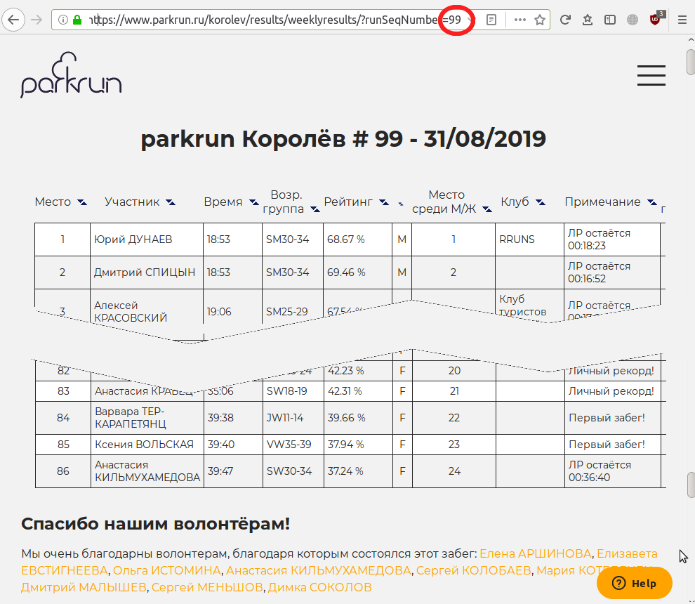

# parkrun volunteers

korolev_volunteers.sh - это скрипт для подсчета статистики волонтеров на забегах паркран. Я его написал для своего домашнего забега в г.Королёв, отсюда такое название, но он может использоваться для любого другого забега. 

Парковые забеги (parkrun) - это свободные и бесплатные пробежки на дистанцию пять километров, которые проводятся каждую субботу и организуются силами самих участников. На домашней странице каждого забега доступна полная статистика результатов. Из результатов скрипт выгружает информацию о волонтерах, тех участниках, которые помогали в проведении забега, и выдает сводную информацию

Подробно о забегах паркран можно почитать на сайте движения: https://www.parkrun.ru Здесь же можно найти список всех российских забегов

# Запуск и параметры командной строки

Для работы необходимы установленные bash, curl и awk. При запуске без параметров скрипт будет обрабатывать результаты сайта https://www.parkrun.ru/korolev/ Поддерживается единственный параметр командной строки, который используется для указания имени забега, например 

./korolev_volunteers.sh kolomenskoe

./korolev_volunteers.sh izmailovo

./korolev_volunteers.sh korolev

Статистика по волонтерам извлекается из блока "Спасибо нашим волонтерам" на странице результатов

Информация выводится в терминал, так же на диске сохраняются два файла

имя_забега_all_results.html со всеми финишными протоколами

volonteers_имя_забега.txt c информацией о волонтерах

